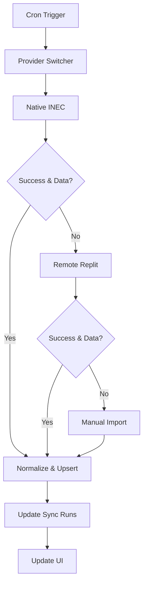

# CivicLens Data Providers

This document describes the data provider architecture and required environment variables for CivicLens.

## Provider Architecture

CivicLens uses a multi-tier provider system with automatic fallback:

1. **Native INEC Provider** (`inec.native.ts`) - Primary source
2. **Remote Replit Provider** (`inec.remote.ts`) - Fallback API
3. **Manual Import Provider** (`inec.manual.ts`) - Admin uploads

## Provider Priority

The system tries providers in order and falls back if:
- Provider fails with an error
- Provider returns empty/no data
- Network/parsing issues occur

## Environment Variables

### Required Secrets (Supabase)

Configure these in Supabase Edge Functions settings:

```bash
# Supabase Configuration
SUPABASE_URL=https://cjyjfxeeyumstsfsknyb.supabase.co
SUPABASE_ANON_KEY=eyJhbGciOiJIUzI1NiIsInR5cCI6IkpXVCJ9...
SUPABASE_SERVICE_ROLE_KEY=eyJhbGciOiJIUzI1NiIsInR5cCI6IkpXVCJ9...

# INEC Data Sources
INEC_TIMETABLE_URLS=https://inec.gov.ng/timetable.pdf,https://inec.gov.ng/schedule.html
INEC_CANDIDATE_FILES=https://inec.gov.ng/candidates.csv,https://inec.gov.ng/nominees.xlsx
INEC_RESULTS_LINKS=https://inecelectionresults.ng,https://irev.inec.gov.ng

# RSS Feeds
FACTCHECK_RSS=https://africacheck.org/feed,https://dubawa.org/feed
CIVIC_RSS=https://civichive.org/feed,https://yiaga.org/feed

# Mapping Services (Optional)
MAPBOX_TOKEN=pk.eyJ1IjoieW91cnVzZXIiLCJhIjoiY2xrM...
GOOGLE_MAPS_KEY=AIzaSyBvOkBwgGlc9FuuHo...

# Replit Fallback API (Optional)
REPLIT_API_BASE=https://your-repl.replit.app
REPLIT_API_KEY=your-secret-key
```

## Provider Details

### 1. Native INEC Provider

**Purpose**: Parse official INEC documents directly

**Data Sources**:
- PDF timetables (election schedules, deadlines)
- CSV/XLSX candidate lists  
- HTML result pages

**Features**:
- PDF text extraction using `pdf-parse`
- CSV parsing for candidate data
- Checksum-based deduplication
- Retry with exponential backoff

**Error Handling**:
- Graceful degradation on parse failures
- Preserves last good data snapshot
- Detailed logging for debugging

### 2. Remote Replit Provider  

**Purpose**: Fallback to working Replit API

**Endpoints**:
- `GET /elections` - Election list
- `GET /races?election=ID` - Races for election
- `GET /candidates?race=ID` - Candidates for race  
- `GET /deadlines` - Important dates
- `GET /results` - Vote counts (if available)

**Authentication**: Bearer token via `REPLIT_API_KEY`

### 3. Manual Import Provider

**Purpose**: Admin-uploaded data via dashboard

**Features**:
- Drag & drop CSV/XLSX upload
- Column mapping wizard
- Validation with error reports
- Versioned snapshots
- Preview before commit

**Merge Rules**: 
- INEC (native/remote) takes precedence
- Manual data fills gaps
- Source URL tracking

## Data Flow



## Sync Schedule

- **INEC Data**: Every 6 hours
- **News Feeds**: Every 30 minutes  
- **Fact Checks**: Every 30 minutes

## Database Schema

All providers normalize data to these tables:

- `elections` - Election metadata
- `races` - Contests within elections
- `candidates` - Candidates per race
- `deadlines` - Important dates
- `polling_units` - Voting locations
- `results` - Vote counts (when available)
- `sync_runs` - Provider execution logs

## Error Handling

1. **Network Errors**: Retry with exponential backoff
2. **Rate Limiting**: Extended backoff for 429 responses
3. **Parse Errors**: Log error, preserve last good data
4. **Empty Results**: Try next provider in chain

## Admin Dashboard

Access at `/admin` to:

- Trigger manual syncs
- View sync history and errors
- Upload manual data files
- Monitor dataset counts
- Review latest changes

## Testing

```bash
# Test individual providers
npm run test:providers

# Integration test - full sync cycle  
npm run test:sync

# Validate data integrity
npm run test:data
```

## Troubleshooting

**Common Issues**:

1. **PDF Parsing Fails**: Check `INEC_TIMETABLE_URLS` format
2. **Empty Results**: Verify RSS feeds are accessible
3. **Rate Limited**: Reduce sync frequency or add delays
4. **Auth Errors**: Check Supabase service role key

**Logs**: Check Supabase Edge Function logs for detailed error messages.

## Contributing

When adding new providers:

1. Extend `BaseProvider` class
2. Implement required methods
3. Add to `ProviderSwitcher` 
4. Update environment variables
5. Add tests and documentation